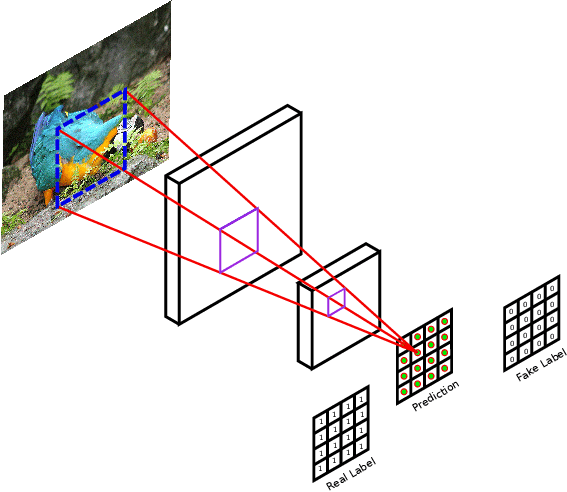
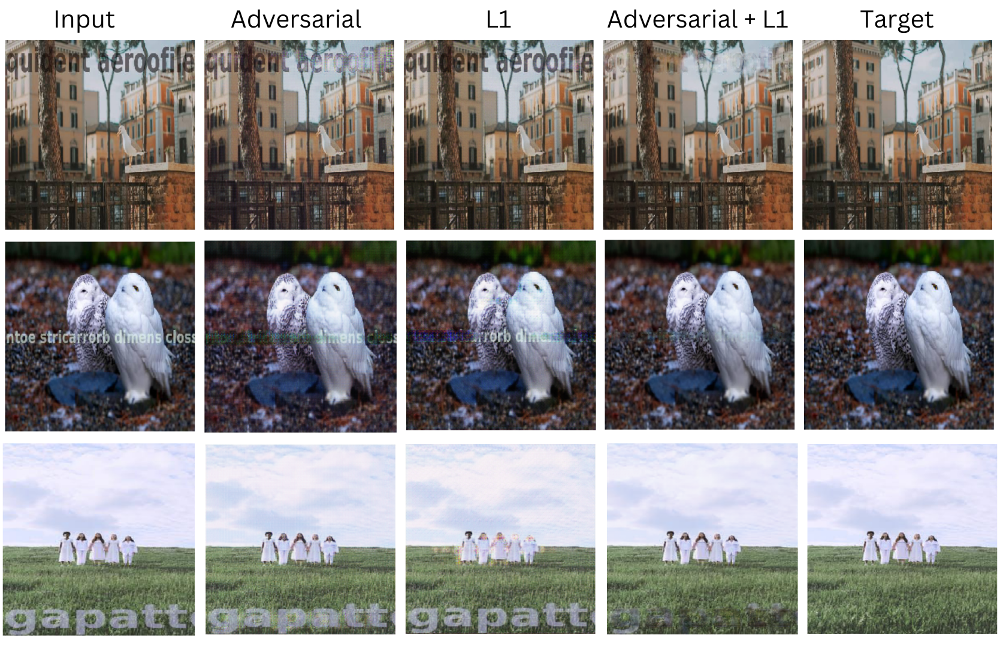
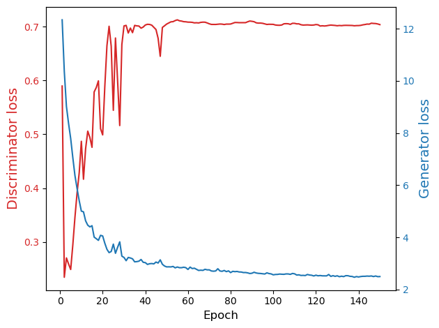
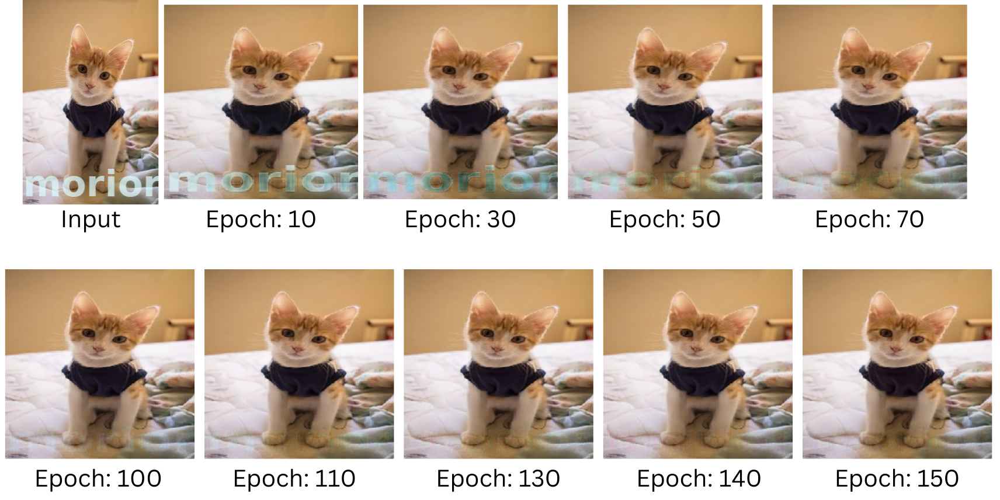

# 
REMOVE WATERMARKS FROM IMAGES WITH GANS

Image and video copyright have emerged as significant issues with the rapid development
of the Internet. In order to preserve copyright, watermarks are frequently used in images.
Generally, To protect the copyright and themselves from all kinds of risk, such as reposting
without credit, creators use a visible or invisible watermark on the image. This suggests
that the strength of the watermark is very important. However, the watermarks are
frequently damaged and destroyed. The impact of watermark removal techniques directly
indicates the reliability of watermarks. In recent years, more focus has been placed on
the development of watermark removal algorithms in order to increase the robustness
of watermarks. Previously, watermark removal algorithms required the position of the
watermark. Following that, a removal algorithm based on the position and attributes of
the watermark is suggested. The watermark removal method will run into issues if the
watermark is randomly placed or has different angles. Some models require marking the
watermark manually, and some require many images with the same watermark. If the
transparency of the watermark is less, some models could not remove the watermark;
they only perform well when the watermark is dense. To solve these problems, we used a
visible watermark removal algorithm based on generative adversarial networks (GANs).
The idea is that a model would remove a variety of watermarks without losing the image’s
quality. No matter what kind of image it is or what kind of watermark it has, this model
should work. The model is trained and tested on the large image data set available
publicly on the internet. This research aims to show that visible watermarks should be
created so that they are not only striking enough to indicate ownership but also more
resilient to removal-related attacks.
  

# DATASET

For the training and testing. I used a dataset openly available on Kaggle. The dataset is divided
into training and validation with an 80/20 ratio. Each folder contains watermarked and
non-watermarked images in the ratio of 50:50. Each folder in the training data contains
nearly 12000 images, for both watermarked and nonwatermarked. And the validation
set consists of nearly 3300 images for each. The watermark is randomly generated for
each image. Furthermore, the transparancy, size, and location are randomly set as shown in Fig. Some watermarks
are designed in such a way that they are difficult to detect in an image.

For the training of GAN for watermark removal, I needed a dataset in which I could use
both watermark and non-watermark images in parallel. The images in the dataset, both
watermarked and unwatermarked, are random; they are not identical in the watermarked
and non-watermarked image folders. So, first, I saved all the image names in a python 
list for both folders, then I made a separate list for the image names that were common in
both lists and arranged them in the same manner. So, now I can use both watermarked
and non-watermarked images in parallel by calling both lists together. After matching
file names from both folders, I have now found 1741 images that are common in both
folders, which I can use as training images. And from the validation folder, I got 107
common images, which I will use for testing purposes. The images are random in size,
which is not suitable for image processing in my model. So, I loaded images, resized
them to 256x256 shape, and converted them into array form. I exported this translated
image array as a compressed numpy array and saved the file. So, I don’t have to do data
pre-processing every time I do model training.

# Model Architecture

## U-Net Generator

I used a U-Net architecture, followed by a fully convolutional network as a generator. The skip connections in U-Net allow the sharing of edge details and global information between input and output. It combines low-level features and high-level features. There are skip connection between first and last generator blocks as shown in fig. 

 

The Generator structure is divided into two parts: Encoder and Decoder. In downsampling, the size (height and width) of the image is reduced by half, and the features are doubled.

* Encoder (Downsampling): The encoder network has seven convolutional blocks. Each convolutional block has a convolutional layer with a striding of two, followed by the Leaky ReLU activation function (slope of 0.2). Except for the first convolutional layer, all other blocks are followed by the batch normalization layers. The construction of the encoder block is as follows: C64-C128-C256-C512-C512-C512- C512-C512. In downsampling, the size (width and height) of the image is reduced by half, and the features are doubled.

* Decoder (Upsampling): The decoder network has seven transposed convolutional blocks. These blocks contain convolutional transpose layers followed by batch normalization layers and a ReLU activation function. It has optional dropout layers. The construction of the decoder block is as follows: CD512-CD512-CD512- C512-C256-C128-C64. The skip connection is made from the encoder model to the decoder model. In upsampling, the size (width and height) of the image is doubled, and the features are reduced by half.

## Patch-Based Discriminator

Unlike simple GAN discriminator, which gives output in scaler probability of input image
as real or fake, I used a patch-based discriminator in my work. Adding a patchbased 
discriminator can increase the effectiveness of our cGANs-based network’s ability
to remove visible watermarks. The discriminator’s architecture is as follows: C64-C128-
C256-C512. Each block contains a convolution layer, a batch normalization layer (except
the first layer), and LeakyReLU. The sigmoid activation function is used after the output
of the last layer. The Adam optimizer function has been used here with a small learning
rate and beta 0.5. For each model update, the discriminator loss is weighted by half.

 

## Objective Function

 

The objective of the generator
is the combined loss of adversarial and L1 loss, with a weight ratio of 1:100. 
Here, generator G is trained to minimize objective G∗ against discriminator
Discriminator D which is trained to maximize the loss. 

- Adversarial Loss

  
  
  
- L1 Loss

  
  
# TRAINING
 For the training, I used mini-batch SGD (batch size is 1) and apply the Adam
solver, with an initial learning rate of 0.0002 and momentum parameter β1 = 0.5.
The model is trained for different epochs, for example, 100, 150, and 200, to check the
improvements in results.

During inference time, the generator is run exactly in the same manner as during training
time. This is different from the standard technique in that we use dropout during testing,
and I apply batch normalization using test batch statistics rather than aggregate training
batch statistics. This method of batch normalizing, known as "instance normalization",
has been shown to be efficient for image generation tasks when the batch size is set to 1.

## Evaluation metrics
For the quantitative GAN generator evaluation, I used image quality measures (PSNR
and DSSIM) as evaluation metrics. Peak signal-to-noise ratio (PSNR) and structural
dissimilarity image index (DSSIM) both measure how similar the generated image looks
to the target image.
* Peak signal-to-noise ratio (PSNR)

  
  
  
* Structural dissimilarity image index (DSSIM)

  

# RESULTS
The objective function has two components: the adversarial loss term and the L1
loss term. I conducted the training for each loss term and combined term to analyze the
effect of the loss terms on the generator output.

## Training Analysis

Loss  | PSNR | DSSIM
------------- | ------------- | -------------
cGAN  | 61.84 | 0.0668
L1  | 61.56 | 0.0749
L1 + cGAN | 67.44 | 0.00781

## Testing Analysis
From the testing dataset,
which I have 107 images in both watermarked and non-watermarked folders, I took a
random 50-image sample to test on each trained model. After testing, I calculated PSNR
and DSSIM by comparing them with the target image for all 50 samples. This is done
for all three models.

Loss  | PSNR | DSSIM
------------- | ------------- | -------------
cGAN  | 61.90 | 0.06115
L1  | 61.67 | 0.07515
L1 + cGAN | 66.43 | 0.01583

## Visualization

watermark quality for test samples for different losses

## Effect of Epochs number:

In the plot, we can see that The discriminator loss is fluctuating much in the stating
epoch, and after some epochs, it is trained and gets stable at a some value. While the
generator gets better and better from the beginning to the end of the epoch, after the
discriminator stabilized, the change in the generator is very low and negligible. After 60
epochs, both the generator and discriminator stabilize, and we can say that the GAN
has converged. The best way to validate this is to plot the generated image from the
test dataset, which also serves as a good way to determine whether the model has been
properly trained.

Image output after number of epochs

#CONCLUSION
This project presented the framework for visible watermark removal by combining the L1
loss function with adversarial loss for training a conditional generative adversarial network. The proposed model is able to remove watermarks without marking the region of
the watermark or removing a totally random watermark with a convincing solution. The
findings suggest that the proposed network approach is promising for removing unknown
watermarks. Various types of watermarks are randomly distributed and used to train a
watermark removal model in order to improve the capacity and robustness of the network. Experimental results show that our proposed framework is effective for unknown
watermark removal.
